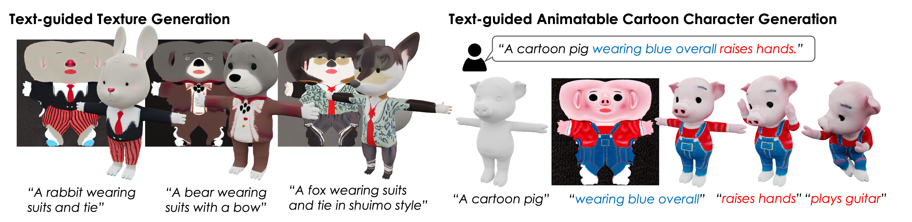

# Make-It-Vivid
The official code of "Make-It-Vivid: Dressing Your Animatable Biped Cartoon Characters from Text"

### [Project Page](https://make-it-vivid.github.io/) | [Paper (ArXiv)](https://make-it-vivid.github.io/)

[Junshu Tang](https://junshutang.github.io/)1,
[Yanhong Zeng](https://zengyh1900.github.io/)2,
[Ke Fan](https://openreview.net/profile?id=~Ke_Fan2)1,
[Xuheng Wang](https://github.com/xUhEngwAng)3,
[Bo Dai](https://daibo.info/)2,
[Kai Chen](https://chenkai.site/)2,
[Lizhuang Ma](http://dmcv.sjtu.edu.cn/)1

1Shanghai Jiao Tong University, 2Shanghai AI Lab, 3Tsinghua University

## Abstract
> Creating and animating 3D biped cartoon characters is crucial and valuable in various applications. Compared with geometry, the diverse texture design plays an important role in making 3D biped cartoon characters vivid and charming. Therefore, we focus on automatic texture design for cartoon characters based on input instructions. This is challenging for domain-specific requirements and a lack of high-quality data. To address this challenge, we propose Make-It-Vivid, the first attempt to enable high-quality texture generation from text in UV space. We prepare a detailed text-texture paired data for 3D characters by using vision-question-answering agents. Then we customize a pretrained text-to-image model to generate texture map with template structure while preserving the natural 2D image knowledge. Furthermore, to enhance fine-grained details, we propose a novel adversarial learning scheme to shorten the domain gap between original dataset and realistic texture domain. Extensive experiments show that our approach outperforms current texture generation methods, resulting in efficient character texturing and faithful generation with prompts. Besides, we showcase various applications such as out of domain generation and texture stylization. We also provide an efficient generation system for automatic text-guided textured character generation and animation.

## Code is Comming Soon!
